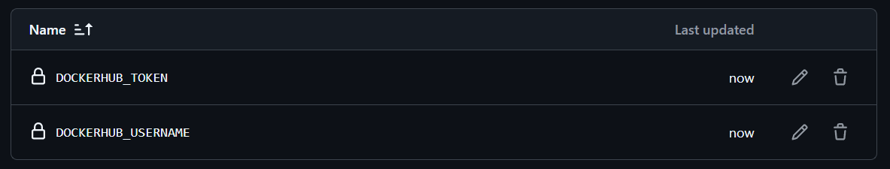

# Simple DevOps project for beginners:

# What is Terraform?
Terraform is an open-source tool used to automate the creation, management, and provisioning of cloud infrastructure. It allows you to define your infrastructure as code (IaC) using configuration files, so you can deploy, update, and version your resources consistently across different cloud providers.

## Beginner
#### 1. Create AWS VPC with Terraform

###### _./main.tf_
```python
#VPC
module "vpc" {
  source                = "terraform-aws-modules/vpc/aws"
  version               = ">= 3.14.2"
  name                  = "FEBEDB-VPC"
  cidr                  = var.vpc_cidr #10.0.0.0/16

  azs                   = data.aws_availability_zones.available.names

  public_subnets        = [cidrsubnet(var.vpc_cidr, 8, 0)] #10.0.0.0/24
  private_subnets       = [cidrsubnet(var.vpc_cidr, 8, 1)] #10.0.1.0/24

  enable_dns_hostnames  = true
  enable_dns_support    = true
  enable_nat_gateway    = true
  single_nat_gateway    = true

}
```
#### 2. Create EC2 with Terraform
###### _./main.tf_
```python
#Backend Server and DB
resource "aws_instance" "BE_server" {
  ami                    = data.aws_ami.ubuntu.id
  instance_type          = var.instance_type

  vpc_security_group_ids = [ aws_security_group.default_security_group.id ]
  subnet_id              = module.vpc.private_subnets[0]

  tags = {
    Name                 = var.instance_name_BE
  }

  provisioner "file" {
    source               = "../Dockerfiles/backend/*"
    destination          = "/home/ubuntu/backend/"
  }

  provisioner "file" {
    source               = "../Dockerfiles/database/*"
    destination          = "/home/ubuntu/database/"
  }

  connection {
    type                 = "ssh"
    user                 = "ubuntu"
    private_key          = file("~/.ssh/terraform-key")
    host                 = self.public_ip
  }

  provisioner "remote-exec" {
    inline               = [
                            var.cmd_update,
                            var.cmd_docker_install,
                            var.cmd_docker_compose_install,
                            var.cmd_docker_permissions,
                            "cd /home/ubuntu/backend && docker-compose up -d",
                            "cd /home/ubuntu/database && docker-compose up -d"
                          ]
  }

}
```
#### 3. Containerize three tier application (FE, BE, DB) with Docker

###### _./AWS/Dockerfiles/backend/BE.Dockerfile_
```docker
FROM python:3.12-slim
WORKDIR /app
COPY requirements.txt .
RUN pip install --no-cache-dir -r requirements.txt
COPY . .
EXPOSE 8000
CMD ["uvicorn", "main:app", "--host", "0.0.0.0", "--port", "8000"]
```
###### _./AWS/Dockerfiles/frontend/FE.Dockerfile_
```docker
FROM node:20-slim
WORKDIR /app
COPY package*.json ./
RUN npm install
COPY . .
RUN npm run build
RUN npm install -g serve
EXPOSE 3000
CMD ["serve", "-s", "build", "-l", "3000"]
```
###### _./AWS/Dockerfiles/database/DB.Dockerfile_
```docker
FROM mongo:7.0
EXPOSE 27017
ENV MONGO_INITDB_ROOT_USERNAME=admin
ENV MONGO_INITDB_ROOT_PASSWORD=admin
```
#### 4. Create simple GitHub Actions pipeline to build and push docker images to Docker Hub
We will create 2 new Secrets in our GitHub:
- DOCKERHUB_USERNAME
- DOCKERHUB_TOKEN

Then assuming we created a ```.\.github\workflows``` folder, we will place inside the config files. (```docker-build.yml```)

After that, we will set all the jobs we want to configure.

###### _EXAMPLE_
```yml
  build-backend:
    runs-on: ubuntu-latest
    steps:
      - uses: actions/checkout@v4

      - name: Log in to Docker Hub
        uses: docker/login-action@v3
        with:
          username: ${{ secrets.DOCKERHUB_USERNAME }}
          password: ${{ secrets.DOCKERHUB_TOKEN }}

      - name: Build and push API image
        uses: docker/build-push-action@v6
        with:
          context: ./AWS/Dockerfiles/backend
          file: ./BE.Dockerfile
          push: true
          tags: ${{ secrets.DOCKERHUB_USERNAME }}/backend:latest
```

#### 5. Create simple GitHub Actions pipeline to deploy docker images to EC2

## Advanced:
#### 1. Store Terraform state on S3
#### 2. Write docker-compose for three tier app
#### 3. Automate Terraform plan and apply with GitHub Actions